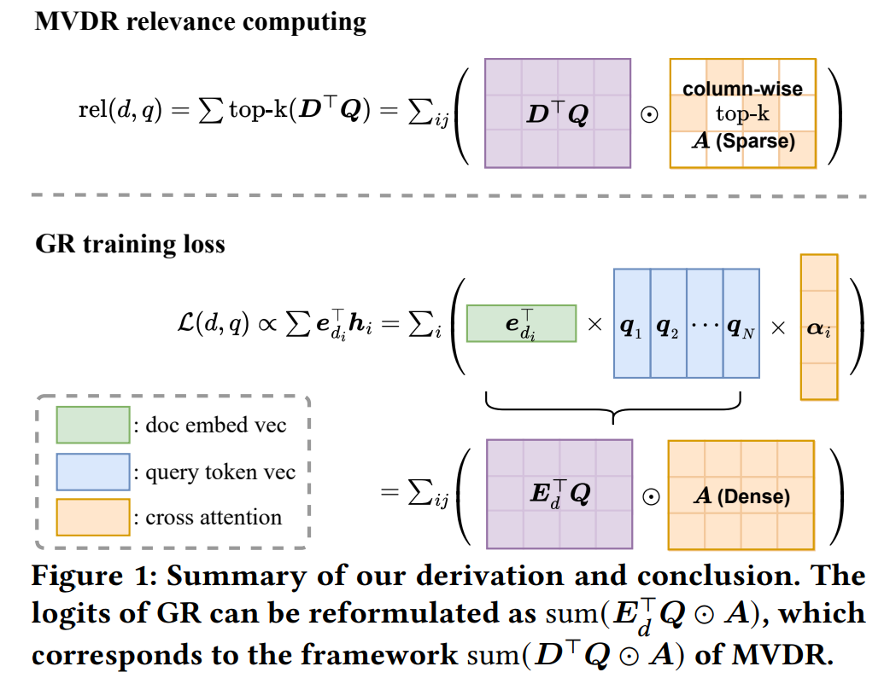

# GR as MVDR

This repository contains the code to reproduce the experiments from our paper **Generative Retrieval as Multi-Vector Dense Retrieval**, which has been accepted by SIGIR'24.

**note**: we will post our paper on arXiv as a pre-print version soon and provide the link to the checkpoints of our re-implemented T5-ColBERT and T5-SEAL.

## Abstract

> Generative retrieval generates identifiers of relevant documents in an end-to-end manner using a sequence-to-sequence architecture for a given query. The relation between generative retrieval and other retrieval methods, especially those based on matching within dense retrieval models, is not yet fully comprehended. Prior work has demonstrated that generative retrieval with atomic identifiers is equivalent to single-vector dense retrieval. Accordingly, generative retrieval exhibits behavior analogous to hierarchical search within a tree index in dense retrieval when using hierarchical semantic identifiers. However, prior work focuses solely on the retrieval stage without considering the deep interactions within the decoder of generative retrieval.
> 
> In this paper, we fill this gap by demonstrating that generative retrieval and multi-vector dense retrieval share the same framework for measuring the relevance to a query of a document. Specifically, we examine the attention layer and prediction head of generative retrieval, revealing that generative retrieval can be understood as a special case of multi-vector dense retrieval. Both methods compute relevance as a sum of products of query and document vectors and an alignment matrix. We then explore how generative retrieval applies this framework, employing distinct strategies for computing document token vectors and the alignment matrix. We have conducted experiments to verify our conclusions and show that both paradigms exhibit commonalities of term matching in their alignment matrix.
> 
> Our finding applies to many generative retrieval identifier designs and provides possible explanations on how generative retrieval can express query-document relevance. As multi-vector dense retrieval is the state-of-the-art dense retrieval method currently, understanding the connection between generative retrieval and multi-vector dense retrieval is crucial for shedding light on the underlying mechanisms of generative retrieval and for developing, and understanding the potential of, new retrieval models.



## prepare python environment

```commandline
pip install -r requirements.txt
```

## Common parameter setting

`common_settings/*.sh` is the dataset-specific parameters, such as max query length, etc.

## Multi-Vector Denser Retrieval (MVDR)

`mvdr.py` and `faiss_index.py`

reproduce `ColBERT`, based on `T5`, you can change it to `BERT`

run `bash mvdr_run_scripts/run.sh`

This will create an output directory in `output/mvdr.DATA.train` by default, which is the `$EXP_DIR` defined in `mvdr_run_scripts/params.sh`

All MVDR-related parameters are in `mvdr_run_scripts/params.sh`.

## Generative Retrieval (GR)

### install SEAL

SEAL needs a working installation of [SWIG](https://www.swig.org/), e.g. (on Ubuntu):
```commandline
sudo apt install swig
```

or using `conda`:

```commandline
conda install swig
```

We also assume that `pytorch` is already available in your environment. SEAL has been tested with version 1.11.

Clone this repo with `--recursive` so that you also include the submodule in `res/external`.
```commandline
git clone --recursive https://github.com/facebookresearch/SEAL.git
```

Compile and install `sdsl-lite`:
```commandline
env CFLAGS='-fPIC' CXXFLAGS='-fPIC' res/external/sdsl-lite/install.sh
```

Install other dependencies:
```commandline
pip install -r requirements.txt

# pyserini
# pip install -r requirements_extra.txt
```

Now install this library.
```commandline
pip install -e .
```

#### Note

Since SEAL uses an older version of transformers, so there are a few places that need to be updated

You can directly copy our fixed version of `seal/beam_search.py` to your SEAL workplace

```commandline
cp beam_search.py /path/to/SEAL/seal/
```

And you can use `git diff` to check the difference.

### Our reproduced gr

`gr.py`

reproduce SEAL using title and substring as identifiers, `t5` only

the usage is similar to MVDR

run `bash gr_run_scripts/run.sh`

This will create an output diretory in `output/gr.DATA.train` by default, which is the `$EXP_DIR` defined in `gr_run_scripts/params.sh`

All GR related parameters are in `gr_run_scripts/params.sh`.

